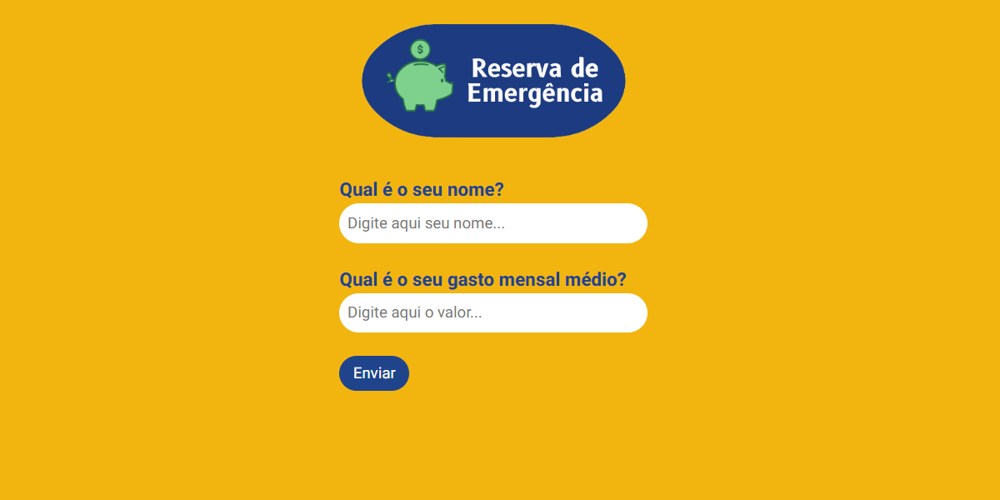

# reserva-de-emergencia
 💰 Uma página dedica a calcular o quanto você precisa ter de Reserva de Emergência. Nessa calculadora você irá inserir o seu gasto mensal médio e automaticamente você receberá os valores nessa seguinte ordem:

1.	Pequena Reserva (3 Meses): a calculadora revelará o valor necessário para cobrir três meses de despesas, proporcionando uma rede de segurança inicial.
2.	Reserva Média (6 Meses): Expandindo a visão, ela também mostrará o valor necessário para uma reserva que pode cobrir seis meses de custos de vida, oferecendo uma camada extra de segurança.
3.	Grande Reserva (12 Meses): Para aqueles que desejam uma reserva de emergência mais substancial, a calculadora 

## 🚀 Tecnologias

Esse projeto foi desenvolvido com as seguintes tecnologias:

- HTML.
- CSS.
- JavaScript.
- Git e Github.
- Figma (Desenvolver o Layout).
- Canva (Criar o LogoTipo).

## 💻 Compartilhe

Acesse minha Calculadora de Reserva de Emergência aqui: https://joaquimsp.github.io/reserva-de-emergencia/

Compartilhe esta ferramenta com amigos, familiares e colegas que também possam se beneficiar dela. Juntos, podemos fortalecer nossa segurança financeira e enfrentar o futuro com confiança. Nunca subestime o poder de estar preparado para o inesperado.
